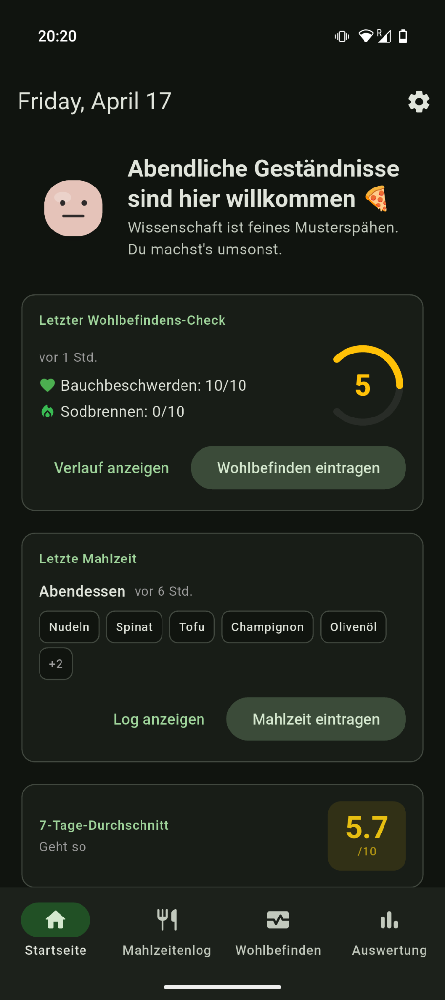
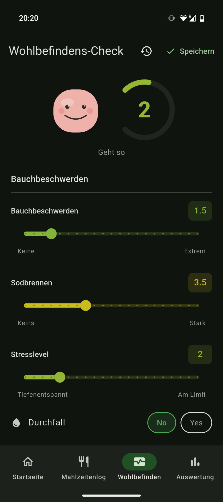
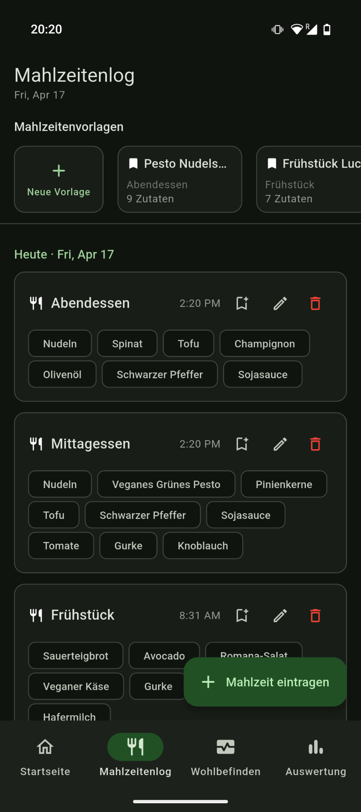
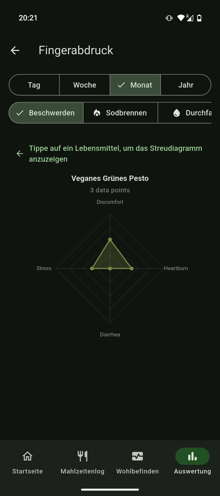
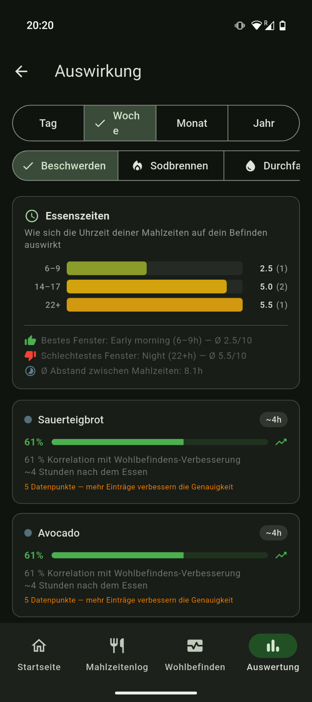
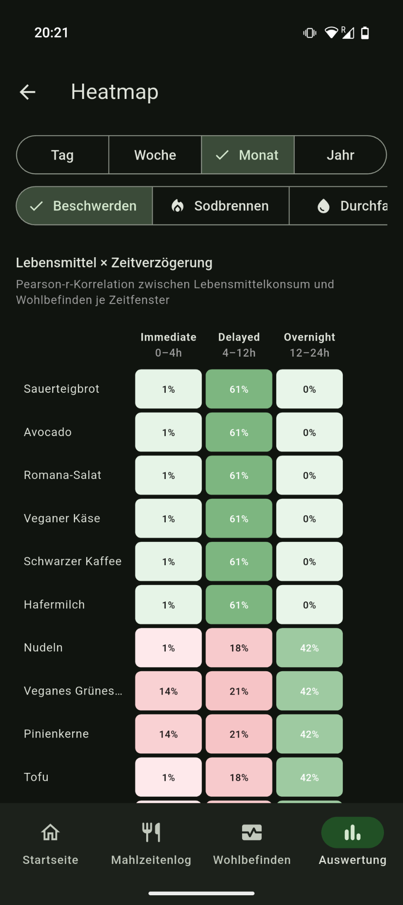

<div align="center">


# GutCheck 🥗

**Your gut, but scientific.**
A local-first, cross-platform digestive health tracker built with Flutter.
Log meals, track how you feel, and discover which foods are secretly plotting against you.

[](https://flutter.dev)
[](LICENSE)
[]()
[]()

</div>

---

## ✨ Why GutCheck?

Most food trackers care about calories. **GutCheck cares about how you feel.**
It quietly correlates what you eat with how your gut reacts — no cloud, no account, no nonsense.

- 🧠 **Find hidden triggers** — Pearson correlations tell you which foods line up with symptoms
- 🗓️ **Calendar + heatmap views** — spot weekly rhythms at a glance
- 🔬 **Food fingerprints** — a symptom signature per ingredient
- ⏱️ **Meal-timing analysis** — is late dinner really the culprit?
- 🌱 **Beautifully local** — your data never leaves your device

## 📸 Screenshots

<div align="center">
  
  
  
</div>
<div align="center">
  
  
  
</div>

<p align="center"><sub>Daily dashboard · Wellness check · Meal log · Food fingerprint · Correlations · Delay heatmap</sub></p>

## 🚀 Quick Start

```bash
git clone https://github.com/FreaxMATE/GutCheck.git
cd GutCheck
flutter pub get
flutter pub run build_runner build --delete-conflicting-outputs
flutter run
```

That's it. No API keys, no sign-up, no onboarding funnel.

## 🛠️ Tech Stack

| | |
|---|---|
| 🎨 **Framework** | Flutter 3.11+ / Dart 3.11 |
| 💾 **Database** | [Isar](https://isar.dev) (on-device, reactive) |
| 🔄 **State** | [Riverpod](https://riverpod.dev) 2.6 |
| 🧭 **Routing** | [GoRouter](https://pub.dev/packages/go_router) 14 |
| 📈 **Charts** | [FL Chart](https://pub.dev/packages/fl_chart) 0.68 |
| 🌍 **i18n** | Flutter `intl` — English + Deutsch |

## 📦 Building

<details>
<summary><b>Android</b></summary>

```bash
flutter build apk --release          # APK
flutter build appbundle --release    # Play Store bundle
```
</details>

<details>
<summary><b>iOS</b></summary>

```bash
flutter build ios --release
```
</details>

<details>
<summary><b>Web (PWA)</b></summary>

```bash
flutter build web --release
```
See [WEB_BUILD_NOTES.md](WEB_BUILD_NOTES.md) for platform specifics.
</details>

<details>
<summary><b>Linux desktop</b></summary>

```bash
flutter build linux --release
```
</details>

## 🗂️ Project Layout

```
lib/
├── core/                # Router, theme, database, l10n, animations
├── features/
│   ├── home/            # Dashboard
│   ├── meal_log/        # Logging meals + ingredients
│   ├── wellness/        # Symptom check-ins
│   ├── insights/        # Correlations, heatmaps, fingerprints
│   └── pantry/          # Ingredient browser
└── l10n/                # ARB translation files
```

## 🧪 Development

```bash
flutter analyze                                                  # lint
flutter test                                                     # unit + widget tests
flutter gen-l10n                                                 # regen translations
flutter pub run build_runner build --delete-conflicting-outputs  # regen Isar models
dart format lib/ test/                                           # format
```

## 🌐 Landing Page

An Astro site lives in [`astro-site/`](astro-site/) and auto-deploys to GitHub Pages:

```bash
cd astro-site && npm install && npm run dev
```

## 🤝 Contributing

PRs are very welcome! Fork, branch, hack, push, open a PR — keep code tested and formatted, that's all.

Found a bug or have a feature idea? [Open an issue](https://github.com/FreaxMATE/GutCheck/issues) or join [discussions](https://github.com/FreaxMATE/GutCheck/discussions).

## 📜 License

Released under the [GNU AGPLv3](LICENSE) — free as in freedom, copyleft as in karma.

---

<div align="center">

Made with 🦠 and Flutter.
If GutCheck helps you, give the repo a ⭐.

</div>
